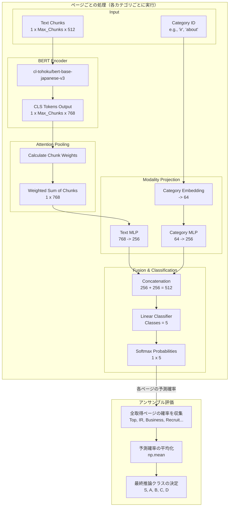

# Revenue Range Classifier
## プロジェクト概要
- 企業のWebサイトのテキストデータから売り上げ規模を5つのクラスに分類する深層学習プロジェクトです。

| クラス | 売上レンジ | 備考 |
|--------|------------|------|
| **S** | 2兆円〜 | 大企業（トップ層） |
| **A** | 8000億〜2兆円 | 大企業 |
| **B** | 5000億〜8000億円 | 中堅・大企業 |
| **C** | 〜5000億円 | 中小・中堅企業 |
| **D** | スタートアップ | J-Startup登録企業など |

- **URL:**　https://haru-first-app-19443304909.asia-northeast1.run.app/

## 使用例(トヨタ自動車株式会社)
APの利用は、Swagger UI（`/docs`）からの実行、または `curl` コマンド等のHTTPクライアントから可能です。

### リクエスト例
`/estimate` エンドポイントに対して、調査したい企業のURLをJSON形式で送信します。

```bash
curl -X 'POST' \
  '[https://haru-first-app-19443304909.asia-northeast1.run.app/estimate](https://haru-first-app-19443304909.asia-northeast1.run.app/estimate)' \
  -H 'accept: application/json' \
  -H 'Content-Type: application/json' \
  -d '{
  "url": "[https://global.toyota/](https://global.toyota/)"
}'
```
### レスポンス例
推論結果とともに、分類の根拠となったクローリングの概要（取得したページ数やカテゴリなど）が返却されます。

```bash
{
  "url": "[https://global.toyota/](https://global.toyota/)",
  "estimated_revenue_class": "S",
  "estimated_revenue_range": "2兆円以上",
  "confidence": 0.5873,
  "class_probabilities": {
    "S": 0.5873,
    "A": 0.1697,
    "B": 0.116,
    "C": 0.0859,
    "D": 0.0411
  },
  "features_summary": {
    "pages_crawled": 60,
    "found_categories": [
      "top",
      "about",
      "business",
      "ir",
      "news",
      "sustainability"
    ],
    "text_length_total": 26006
  },
  "processing_time_sec": 69.57
}
```

## プロジェクトの動機・目的
営業リストの自動スコアリング、競合調査、または投資判断の初期スクリーニングにおいて、その企業がどの程度の規模感なのかを素早く把握することは重要です。
本プロジェクトは、財務諸表などの構造化データがない未上場企業やスタートアップであっても、「Webサイトで発信しているテキスト（事業内容、採用情報、IRなど）」のニュアンスや情報量から、AIが企業の経済的規模を自動で概算できるかを検証・実装することを目的としています

##　クラス推論の概要
### 推論フロー
1. **リクエスト:** ユーザーが `/estimate` エンドポイントに対象企業のURLを送信する。
2. **クローリング:** `Scrapy` を用いたクローラーが起動。トップページだけでなく、内部のカテゴリ分類ロジックを用いて価値の高いリンク（About, Business, IR, Recruitなど）を巡回し、ページごとにテキストを取得する。
3. **前処理 (特徴抽出):** 取得したテキストをモデルが処理できる長さ（チャンク）に分割し、東北大学の日本語BERTトークナイザ (`cl-tohoku/bert-base-japanese-v3`) でトークン化する。
4. **クラス分類:** 後述の「階層型BERTモデル」に入力し、**ページカテゴリごとに売上規模の予測**を行う。その後、取得できた全ページの予測確率の平均をとるアンサンブル評価によって最終的な予測を決定する。
5. **レスポンス:** 最も確率の高いクラス、各クラスの確率分布、推論にかかった時間、取得に成功したページカテゴリ一覧をJSON形式で返却する。

### 推論アーキテクチャ概要
1. **Chunk-level BERT Encoding (長文分割処理)**
   BERTの入力トークン長制限（512トークン）を克服するため、1ページ分の長文テキストを複数のチャンク（テキストの塊）に分割して入力します。各チャンクを `cl-tohoku/bert-base-japanese-v3` に入力し、それぞれの `[CLS]` トークンの表現（768次元）を抽出します。
2. **Attention Pooling (重要チャンクの動的抽出)**
   ページ内のすべてのチャンクが等しく重要とは限りません（例：フッターの免責事項より、事業内容の段落の方が重要）。そこで、各チャンクの `[CLS]` 表現に対してAttention機構（1層のMLP）を適用し、チャンクごとの重要度（Attention Weights）を計算します。これにより、予測に寄与する重要なテキスト情報を動的に重み付けして集約し、1ページを表現する単一のベクトル（768次元）を生成します。
3. **Modality Projection (マルチモーダル特徴空間への射影)**
   テキスト情報と、そのテキストが属する「ページカテゴリ（Top、IR、Recruit、csr等）」のメタデータを効果的に結合するため、独立した射影層を用いています。
   - **Text Projection:** Attention Pooling後のテキストベクトル（768次元）を、MLP（ReLU + Dropout）を通して256次元に圧縮・変換します。
   - **Category Projection:** カテゴリIDをEmbedding層でベクトル化（64次元）した後、同様のMLPを通して256次元に変換します。
4. **Feature Fusion & Classification (特徴結合と分類)**
   共通の次元数（256次元）にマッピングされたテキスト特徴とカテゴリ特徴を結合（Concatenation）し、512次元の融合特徴ベクトルを作成します。最後に、これを線形分類器（Linear層）に入力し、各売上規模クラスの確率（Logits）を出力します。
### アーキテクチャ図



## ディレクトリ構成

```text
.
├── src/                  # ソースコード
│   ├── main.py           # FastAPIのアプリケーション定義・ルーティング
│   ├── predict.py        # モデルのロード・前処理・推論ロジック
│   ├── crawler.py        # Webクローラー定義
│   └── model.py          # モデルアーキテクチャ定義
│    └── dataset.py        # データの成形、トークナイズ
│    └── evaluate.py       # モデルの評価関数
│    └── train.py          # 推論モデルの学習
│    └── features.py       # テキストからの追加特徴量抽出(現行モデルでは使用しない)
├── models/               # モデルの重みファイル（GCSから自動ダウンロード）
├── data/                 # カテゴリマッピング等の静的ファイル
│   └── label_mappings.json
├── Dockerfile            # デプロイ用コンテナ環境構築ファイル
├── cloudbuild.yaml       # Google Cloud Build CI/CD パイプライン設定
├── requirements.txt      # 依存ライブラリ

```

## データ概要
- EDINET DB( https://edinetdb.jp/) における売上ランキングトップ500の企業のHPをクローリングを行って得たテキスト群。
- J-Startup (https://www.j-startup.go.jp/startups/) に登録されている企業の内100社を対象にクローリングして得たテキスト群。

##　技術スタック
- **Machine Learning:** PyTorch, Transformers(Hugging Face)
- **Backend / API:** FastAPI, Uvicorn, Pydantic
- **Infrastructure:** Docker, Google Cloud Run, Cloud Build, Cloud Storage
- **Data Engineering:** Pandas, NumPy
- **Web Crawling:**: Scrapy

##　ドキュメント概要

